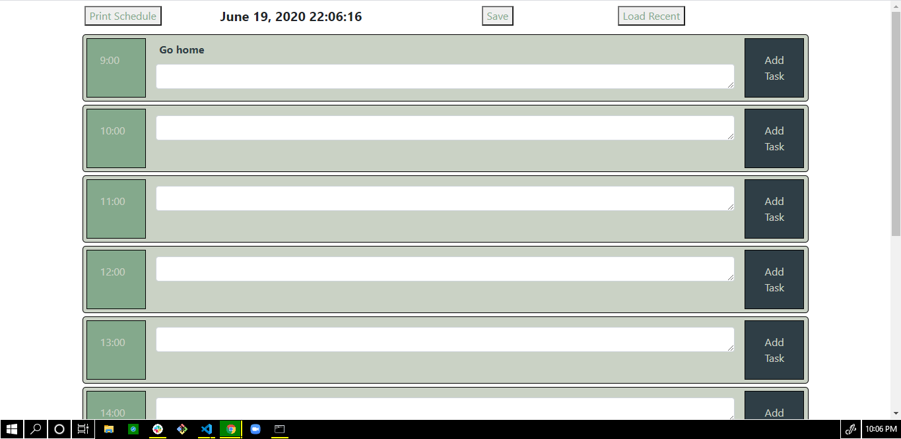

# work_day_scheduler
A simple calendar application.

In this program the user loads the page.  The user then selects 'print schedule' which prints out a series of time blocks.  The user can input a task in the textarea and then add it to the schedule using the Add Task button.  The user can then click 'Save' to save the current schedule or 'Load Recent' to load a previously created schedule.

I used html, css, javascript, and jquery to dynamically produce the HTML on this page.  I ran into difficulty assigning individual id's to all the dynamically produced elements.  Using a for loop and the i variable to create unique id's  for each element fixed this.  I had difficulty getting 'isBetween' to work with the moment() library and eventually settled on the current hour being a standard color and using isAfter and isBefore to change the color of the color blocks during the day.  

Update: currently having difficulty working with local storage and the dynamically produced HTML.  will continue to update.  I am able to store the inputs into local storage, I am still having trouble recalling then printing the saved info into the dynamicaly produced HTML.  The info stores into the local storage, it is console.log'd currently.

